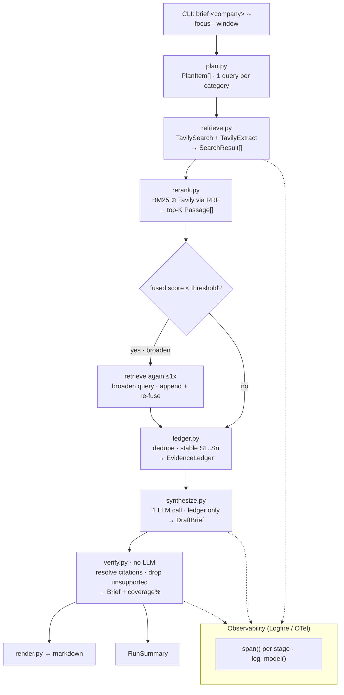
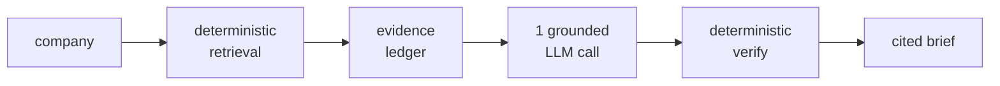
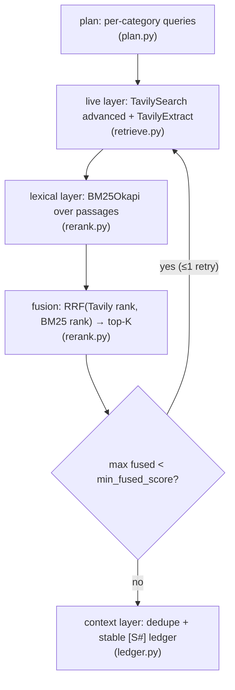
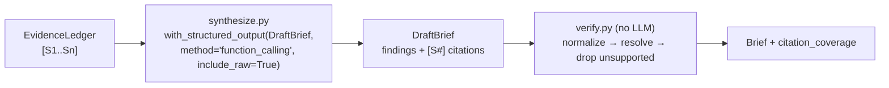
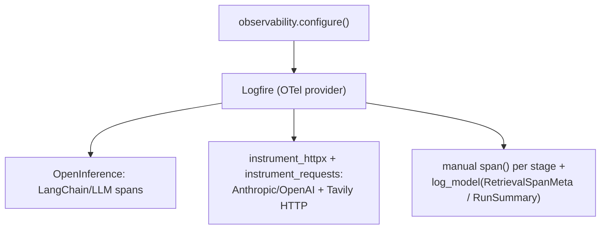
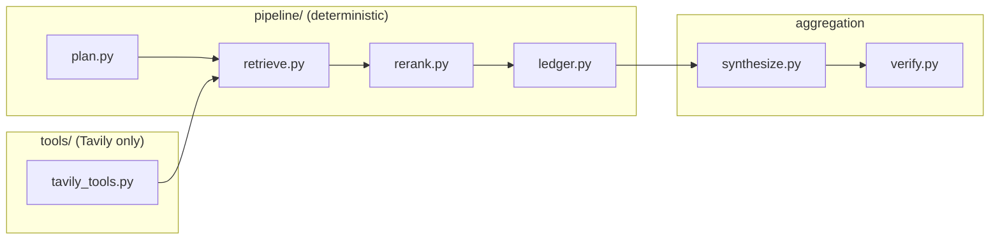

# Explainer — Context engineering for deep research via Tavily Evidence Fusion

> **Option 2 deliverable.** An interesting AI-engineering concept, explained for two readers at once: a finance/corp-dev user who needs the *value*, and an engineer who needs the *code*.

## The one-sentence idea

Deep research fails when a model sees either stale training data or raw, unranked search snippets. **Tavily Evidence Fusion** fixes this by fusing a *live* layer (Tavily) and a *lexical* layer (BM25) into a single, deduped, citable **evidence ledger** — the only thing the model is allowed to see — and then **verifying** every citation deterministically.

## Page template (used by every chapter)

Each chapter follows this dual-audience structure:

```
## Business takeaway        ← 2–3 sentences for the finance/corp-dev reader
## What problem this solves  ← starter limitation → our approach
## How it works (technical)  ← diagram + link to the src module
## Code anchor               ← a real function/class from the repo
## Tavily value              ← why this step needs live web data
```

---

# Architecture

## End-to-end flow

The agent is a **Hybrid RAG pipeline** with a deterministic retrieval half and a single grounded synthesis call. Each stage consumes and produces a typed Pydantic artifact, and each runs inside a Logfire span.



## Why these boundaries (context isolation)

Each module has one job and a narrow, typed interface. This is the same benefit a hierarchical/subagent design buys — separation of concerns and easy verification — but achieved deterministically so every stage is unit-testable:

| Stage | Module | Input → Output | LLM? |
|---|---|---|---|
| Plan | `pipeline/plan.py` | company + focus → `PlanItem[]` | no |
| Retrieve | `pipeline/retrieve.py` + `tools/tavily_tools.py` | `PlanItem` → `SearchResult[]` | no |
| Rerank | `pipeline/rerank.py` | query + `SearchResult[]` → `Passage[]` | no |
| Ledger | `pipeline/ledger.py` | `Passage[]` → `EvidenceLedger` | no |
| Synthesize | `synthesize.py` | `EvidenceLedger` → `DraftBrief` | **yes (1 call)** |
| Verify | `verify.py` | `DraftBrief` + ledger → `Brief` | no |
| Render | `render.py` | `Brief` → markdown | no |

The single LLM call is sandwiched between deterministic retrieval and deterministic verification — so the non-deterministic part is small, observable, and bounded by the ledger it is allowed to see.

## Typed artifacts (the contracts)

All inter-stage data is Pydantic v2 (`models.py`): `SearchResult`, `Passage`, `Citation`, `EvidenceLedger`, `Finding`, `DraftBrief`, `Brief`, plus the observability artifacts `RetrievalSpanMeta` and `RunSummary`. Because these are typed, they double as (a) the structured-output schema the model fills and (b) structured log attributes for Logfire.

## Configuration knobs

Set via env (`.env`) — see `config.py`:

| Setting | Default | Meaning |
|---|---|---|
| `provider` (`CI_MODEL_PROVIDER`) | `anthropic` | Synthesis provider; falls back to whichever key exists. |
| `default_recency_window` | `month` | Tavily `time_range`. |
| `results_per_query` | `5` | Tavily results per category query. |
| `extract_top_n` | `3` | URLs per category to fetch full text for. |
| `top_k_per_category` | `4` | Passages kept after fusion. |
| `passage_char_cap` | `1200` | Token-ish cap per ledger passage. |
| `rrf_k` | `60` | Reciprocal Rank Fusion constant. |
| `min_fused_score` | `0.02` | Below this for a category → self-correction retry. |

---

# 01 · The problem

## Business takeaway

A finance or corp-dev analyst can't paste an unsourced paragraph into an investment memo. A plain "search the web and ask an LLM" agent gives you fluent text with no provenance, no recency guarantee, and no way to tell which sentence is real. That's not a diligence tool — it's a liability.

## What problem this solves

The starter agent does one untuned web search and lets the model free-write. Three things go wrong for a diligence use case:

1. **Stale or hallucinated facts** — the model leans on training data; you can't tell when.
2. **No provenance** — there are no citations, so nothing is verifiable.
3. **No recency control** — "latest funding" might be two years old.

Our approach makes provenance and recency *structural* rather than hoped-for: the model only sees a ranked, dated, citable ledger, and an automated gate drops anything it can't trace.

## How it works (technical)

The fix is to split the one fuzzy step into a deterministic retrieval half, a single bounded LLM call, and a deterministic verification half. See the full picture in the [Architecture section](#architecture) above.




## Code anchor

The contrast is visible in the entry point: a brief is a pipeline, not a single model call.

```79:101:src/competitive_intel/pipeline/orchestrator.py
def run_brief(
    company: str,
    focus_areas: list[Category] | None = None,
    recency_window: str | None = None,
    settings: Settings | None = None,
    model=None,
    configure_observability: bool = True,
) -> tuple["Brief", RunSummary]:  # noqa: F821 - Brief imported lazily below
    """Produce a verified competitive intelligence brief and a run summary."""
```

## Tavily value

The only way to beat stale training data is **live web data on demand**. Tavily is the live layer — and because it returns relevance scores, recency filters, and full-page extraction, it gives us the raw material to rank and cite, not just a list of links.

---

# 02 · Tavily Evidence Fusion

## Business takeaway

This is the engine that makes the brief trustworthy. We pull live results from Tavily, re-rank them so the genuinely on-topic, recent sources rise to the top, and hand the model a tidy, numbered "evidence packet." The analyst gets precision and recency; the model gets no room to wander.

## What problem this solves

Search relevance alone isn't enough for diligence. A semantic search engine might rank a polished blog post above the actual funding announcement. Raw snippets are also noisy and unranked. We need a second, *lexical* opinion and a way to combine the two.

## How it works (technical)

Six steps, three of them deterministic ranking:




1. **Live layer** — advanced Tavily search (finance topic, recency window) + full-text extract.
2. **Lexical layer** — BM25 over the extracted passages, scored against the category query.
3. **Fusion** — Reciprocal Rank Fusion of the two *ranks* (robust to different score scales).
4. **Context layer** — the evidence ledger: deduped, stably numbered, token-capped.
5. **Validation** — thin categories trigger a single broadened re-query.
6. **Synthesis** — covered in [chapter 03](#03--grounded-synthesis--verification) below.

## Code anchor

The fusion itself — combine Tavily and BM25 *ranks* with RRF rather than mixing raw scores:

```56:77:src/competitive_intel/pipeline/rerank.py
    tavily_ranks = _ranks([r.score for r in results])
    bm25_ranks = _ranks(bm25_scores)
    k = settings.rrf_k

    passages: list[Passage] = []
    for i, result in enumerate(results):
        fused = 1.0 / (k + tavily_ranks[i]) + 1.0 / (k + bm25_ranks[i])
        passages.append(
            Passage(
                url=result.url,
                title=result.title,
                text=_compact(result.best_text() or result.title, settings.passage_char_cap),
                published_date=result.published_date,
                category=result.category,
                tavily_score=result.score,
                bm25_score=float(bm25_scores[i]),
                fused_score=fused,
            )
        )
```

And the validation gate that makes retrieval self-correcting:

```57:64:src/competitive_intel/pipeline/orchestrator.py
    # Validation gate: no/low evidence -> broaden the query and retry once.
    if items and (not passages or max_fused < settings.min_fused_score):
        retried = True
        refined = refine_query(items[0], company)
        results.extend(retrieve_for_item(refined, retriever, settings, recency_window))
        passages = fuse_category(refined.query, results, settings)
        max_fused, mean_fused = _fused_stats(passages)
```

## Tavily value

Tavily provides the two ingredients fusion needs and a plain LLM can't: **a relevance score** (one of the ranks we fuse) and `**search_depth="advanced"` + `extract`** (full page text, so BM25 scores real content instead of a one-line snippet). Recency comes free via `time_range`. This is Tavily used the way it's meant to be used — not a single bare `search()`.

---

# 03 · Grounded synthesis & verification

## Business takeaway

The model writes the brief, but it only ever sees the numbered evidence ledger — never the open web or its own memory. Then a non-AI step checks every citation and throws away any claim it can't trace. The number you can trust at a glance is **citation coverage**: the percentage of findings backed by a real source.

## What problem this solves

Even with great evidence, an LLM can drift: cite a source that doesn't say what it claims, or invent an id. We close both gaps — constrain the *input* (ledger only) and verify the *output* (deterministic citation resolution).

## How it works (technical)

Two steps, only the first uses the model:




- **Synthesis** is a single grounded structured-output call (the "generate" half of the [2-step RAG chain](https://docs.langchain.com/oss/python/langchain/rag)) — not a ReAct loop.
- **Verification** has no model: it normalizes citation ids, resolves them against the ledger, and drops findings whose citations don't resolve.

## Code anchor

The grounded call — structured output with `include_raw=True` so we also capture token usage:

```58:74:src/competitive_intel/pipeline/synthesize.py
    model = model or build_model(settings)
    structured = model.with_structured_output(
        DraftBrief, method="function_calling", include_raw=True
    )

    human = (
        f"Company: {company}\n"
        f"Focus areas: {', '.join(focus_areas)}\n"
        f"Recency window: last {recency_window}\n\n"
        f"Evidence (cite by id):\n\n{ledger.render_context()}"
    )
    result = structured.invoke(
        [
            {"role": "system", "content": SYNTHESIS_SYSTEM},
            {"role": "user", "content": human},
        ]
    )
```

The deterministic gate — unresolvable citations mean the finding is dropped:

```60:76:src/competitive_intel/pipeline/verify.py
    for finding in draft.findings:
        resolved: list[str] = []
        for raw in finding.citation_ids:
            cid = normalize_citation_id(raw)
            if cid and cid in valid_ids and cid not in resolved:
                resolved.append(cid)
        clean = finding.model_copy(update={"citation_ids": resolved})
        if resolved:
            kept.append(clean)
            for cid in resolved:
                if cid not in cited_ids:
                    cited_ids.append(cid)
        else:
            dropped.append(clean)

    total = len(draft.findings)
    coverage = round(len(kept) / total, 3) if total else 0.0
```

## Tavily value

Because the ledger is built from Tavily search + extract, "resolving a citation" means resolving to a **real, dated URL the analyst can open**. The verification gate is only meaningful because the underlying evidence is live and addressable — that's what turns "the model cited S3" into "here's the press release, dated last week."

---

# 04 · Observability

## Business takeaway

Every brief produces a full trace: which queries ran, what Tavily returned, how confident the ranking was, whether the agent had to retry, and what fraction of the output was source-backed. For a buyer evaluating Tavily, this is the "show me it actually used live data and didn't make things up" view — in one screen.

## What problem this solves

The starter agent's only visibility is a `print`. When a brief looks thin or wrong, you can't tell *where* — bad queries? no results? a dropped citation? Observability turns the pipeline from a black box into a timeline you can inspect.

## How it works (technical)

One configuration call wires three layers of tracing, and every stage logs a typed artifact:




The typed artifacts are the same Pydantic models that flow through the pipeline (`models.py`), so observability is free: `log_model()` just dumps the model into the log's structured attributes. There is no LangSmith second backend, and with no token everything is a silent no-op.

## Code anchor

Typed artifacts become span attributes via `model_dump()`:

```75:79:src/competitive_intel/observability/__init__.py
def log_model(message: str, model: BaseModel) -> None:
    """Log a typed pipeline artifact as structured attributes."""
    if _logfire is not None:
        _logfire.info(message, **model.model_dump())
```

And the artifact that captures retrieval health per category:

```176:188:src/competitive_intel/models/__init__.py
class RetrievalSpanMeta(BaseModel):
    """Compact, loggable summary of a retrieval/rerank stage for a category."""

    stage: str
    category: Category | None = None
    query: str = ""
    n_results: int = 0
    n_passages: int = 0
    top_k_ids: list[str] = Field(default_factory=list)
    max_fused_score: float = 0.0
    mean_fused_score: float = 0.0
    retried: bool = False
```

See `[docs/runbooks/run-generate-intel.md](../runbooks/run-generate-intel.md)` for what the trace looks like in the Logfire UI.

## Tavily value

Because HTTP is instrumented, the Tavily search/extract calls appear as spans inside each brief — concrete, timestamped proof that the answer came from **live retrieval**. That's the most persuasive artifact in a demo: the data, not just the prose.

---

# 05 · Context isolation (subagents, simpler to verify)

## Business takeaway

The system is built as a set of small, single-purpose steps with clean hand-offs, rather than one giant prompt that tries to do everything. That makes the agent more precise and far easier to trust: each step does one job, and we can check it independently.

## What problem this solves

A monolithic agent (one big prompt + a ReAct tool loop) mixes retrieval, ranking, writing, and checking into a single fuzzy context. That's hard to debug, hard to test, and easy for the model to derail. Hierarchical *subagents* solve this with separation of concerns — but they add coordination overhead and their own non-determinism.

We get the **same isolation benefit deterministically**: each stage is a module with a narrow, typed input and output. The only non-deterministic step (synthesis) is sandwiched between deterministic retrieval and deterministic verification.

## How it works (technical)




Each arrow is a typed Pydantic artifact (`SearchResult`, `Passage`, `EvidenceLedger`, `DraftBrief`, `Brief`). Because the boundaries are typed, every stage is unit-testable in isolation — which is exactly what `tests/test_rag_agent.py` does.

## Code anchor

The orchestrator reads like the architecture diagram — each stage in its own span, consuming the previous stage's typed output:

```108:135:src/competitive_intel/pipeline/orchestrator.py
        with span("retrieve_rerank", n_plan_items=len(plan)):
            for category in focus_areas:
                items = [p for p in plan if p.category == category]
                passages, meta = _retrieve_and_rank_category(
                    category, items, retriever, settings, company, recency_window
                )
                passages_by_category[category] = passages
                metas.append(meta)
                if meta.retried:
                    retries += 1

        with span("ledger"):
            ledger: EvidenceLedger = build_ledger(passages_by_category)
            ...

        with span("synthesize", provider=provider, model=model_name):
            synth = synthesize(
                company, focus_areas, recency_window, ledger, settings, model
            )
```

## Tavily value

Isolating all Tavily access in `tools/tavily_tools.py` means the integration is a single, swappable surface. It's where you'd add domain filters, swap to the Tavily MCP server ([chapter 06](#06--tavily--mcp-the-integration-story)), or tune search depth — without touching ranking, synthesis, or verification.

---

# 06 · Tavily + MCP (the integration story)

## Business takeaway

The exact same Evidence-Fusion retrieval can be exposed to *other* AI platforms — Claude Desktop, OpenAI's Agent Builder, Cursor — through the **Model Context Protocol (MCP)**. That means a competitive-intel capability you build once can be dropped into wherever the analyst already works, without rebuilding the integration each time.

## What problem this solves

Teams don't want a new app per task; they want their existing assistant to gain a new, trustworthy skill. MCP is the standard plug that lets a hosted tool (Tavily) appear as a callable capability inside any MCP-aware agent.

## How it works (technical)

Two ways to reach Tavily, sharing the same downstream pipeline:

```mermaid
flowchart TD
    subgraph default["Runtime (default)"]
        A[CLI] --> B["langchain-tavily<br/>TavilySearch + TavilyExtract"]
    end
    subgraph mcp["Integration story"]
        C["MCP host<br/>(Claude Desktop / Agent Builder)"] --> D["Tavily MCP server<br/>mcp.tavily.com"]
    end
    B --> E["rerank → ledger → synthesize → verify<br/>(unchanged)"]
    D -. same results .-> E
```


Because all Tavily access is isolated in `tools/tavily_tools.py` ([chapter 05](#05--context-isolation-subagents-simpler-to-verify)), swapping the transport from the LangChain tools to an MCP client is a localized change — the fusion, ledger, synthesis, and verification stages don't move.

## Code anchor

The seam that makes this swappable — the single retrieval class everything else depends on:

```36:54:src/competitive_intel/tools/tavily_tools.py
class TavilyRetriever:
    """Live web retrieval layer built on Tavily."""

    def __init__(self, settings: Settings | None = None) -> None:
        self.settings = settings or get_settings()
        if self.settings.tavily_api_key:
            os.environ.setdefault("TAVILY_API_KEY", self.settings.tavily_api_key)

    def search(
        self,
        query: str,
        *,
        category: Category | None = None,
        topic: str = "finance",
        time_range: str | None = None,
        search_depth: str = "advanced",
        max_results: int | None = None,
        include_domains: list[str] | None = None,
    ) -> list[SearchResult]:
```

An MCP-backed retriever would implement the same `search()` / `extract()` shape against the Tavily MCP server (`https://mcp.tavily.com/mcp/?tavilyApiKey=...`) and feed identical `SearchResult`s into rerank.

## Status of the optional `--via-mcp` flag

This is wired as a **stretch / experimental** path. `competitive-intel brief --via-mcp ...` swaps in `McpTavilyRetriever` (`src/competitive_intel/tools/tavily_mcp.py`), which loads Tavily's MCP tools via `langchain-mcp-adapters` and feeds identical `SearchResult`s into the pipeline. It requires the optional extra:

```bash
pip install 'competitive-intel-agent[mcp]'
```

The payload normalizers it shares with the default retriever are unit-tested offline, but the live MCP round-trip has **not** been verified in this build (no live Tavily key / network at build time). The default, fully-verified path remains `langchain-tavily`. See [`explainer-build-log.md`](explainer-build-log.md).

## Tavily value

This is the platform argument for Tavily: build the retrieval quality once (advanced search, extract, recency), and reach it either embedded (LangChain) or via MCP across the whole agent ecosystem. Same trustworthy evidence, many front doors.

---

## Build record

This explainer and the implementation were built with a Cursor coding agent. The full agent session — decisions made, output reviewed, and course-corrections — is in [`explainer-coding-agent-summary.md`](explainer-coding-agent-summary.md).