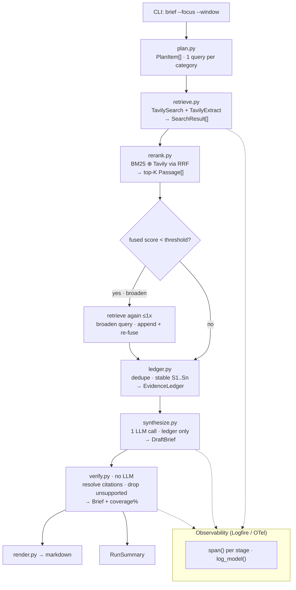

# Technical Statement - Competitive Intelligence Agent

## 1. What this is

A command-line agent that produces a **source-verified competitive intelligence brief** for any company, built on **Tavily** (live web retrieval) + **LangChain** (model orchestration), with **Logfire/OpenTelemetry** observability and a **deterministic evaluation** loop.

It takes the starter agent's idea (search the web, ask an LLM) and turns it into something a professional could actually trust: every claim in the output is traceable to a numbered, dated source, low-evidence categories trigger an automatic re-query, and the whole run is observable as a trace.

```bash
competitive-intel brief "Perplexity" --focus funding,product,pricing --window month
```

## 2. Target audience (who this is for)

**Finance, investment-research, and corporate-development teams doing pre-meeting or pre-deal company diligence.** Concretely:

- **Investor**:
Someone who's prepping for a founder meeting who needs the last month of funding, product, and hiring signals with links they can verify before they cite them in an IC memo.
- **Corp-dev / M&A analyst**:
Building a target profile who needs recency and provenance, not an LLM's stale, unsourced recollection.
- **Competitive-intelligence analyst** 
Who tracks a set of competitors and needs a repeatable, auditable brief rather than ad-hoc Googling.

Why this audience: these users live and die by **recency, precision, and provenance**. They cannot paste an unsourced paragraph into a memo. That is exactly the gap between a plain LLM and a Tavily-grounded pipeline — which makes it the clearest possible demonstration of Tavily's business value.

## 3. The starter's limitation → our approach


|                | Starter agent                    | This agent                                                              |
| -------------- | -------------------------------- | ----------------------------------------------------------------------- |
| Retrieval      | One untuned web search           | Planned per-category queries, advanced search + full-text extract       |
| Ranking        | Whatever order results came back | BM25 + Tavily fused via Reciprocal Rank Fusion                          |
| Grounding      | Model free-writes from snippets  | Model sees only a deduped **evidence ledger** with `[S#]` ids           |
| Trust          | No citations, no provenance      | Every finding cites a resolvable source; unsupported claims are dropped |
| Recovery       | None                             | Low-evidence categories self-correct with one re-query                  |
| Visibility     | A `print` statement              | Logfire trace: plan → retrieve → rerank → synthesize → verify           |
| Quality signal | None                             | Deterministic eval: coverage, source validity, recency adherence        |


## 4. Assignment requirements → implementation mapping

This is the requirements traceability table the assignment asks for: each example direction mapped to the specific module(s) that satisfy it and the value it creates.


| Assignment direction         | Module(s)                                                        | How it creates value                                                                                                          |
| ---------------------------- | ---------------------------------------------------------------- | ----------------------------------------------------------------------------------------------------------------------------- |
| **Real customer workflow**   | `cli.py`, `pipeline/orchestrator.py`, `pipeline/render.py`       | A finance-diligence brief CLI — a concrete job, not a toy demo.                                                               |
| **Tavily integration depth** | `tools/tavily_tools.py`                                          | Advanced search, finance `topic`, `time_range` recency, full-text `extract` — Tavily best practices, not a single `search()`. |
| **Retrieval quality**        | `pipeline/plan.py`, `pipeline/retrieve.py`, `pipeline/rerank.py` | Query enhancement, BM25+RRF fusion, top-K selection, one self-correction retry.                                               |
| **Citations / trust**        | `pipeline/ledger.py`, `pipeline/verify.py`                       | Stable `[S#]` evidence ledger + deterministic citation resolution; unsupported findings dropped.                              |
| **Context engineering**      | `pipeline/plan.py`, `pipeline/rerank.py`, `pipeline/ledger.py`   | Planned queries → fused passages → token-capped, deduped ledger = the only thing the model sees.                              |
| **Observability (bonus)**    | `observability/`, `models/`                                      | Logfire/OTel spans per stage + typed Pydantic artifacts logged as structured attributes.                                      |
| **Eval loop (bonus)**        | `evals/`, `eval/`                                                | Deterministic metrics (coverage, source validity, recency) over golden cases — verifiable, not LLM-judged.                    |
| **Explainer (Option 2)**     | `docs/explainer/`                                                | A publishable, diagram-heavy walkthrough of *Context engineering via Tavily Evidence Fusion*.                                 |


## 5. Workflow

The agent is a **Hybrid RAG pipeline with a fixed control flow**, not a ReAct tool loop. The *orchestration* is deterministic — the same stages run in the same order every time — while the *data* (live web results) and the single synthesis step are where variability lives. This is the [2-step RAG chain](https://docs.langchain.com/oss/python/langchain/rag) pattern: retrieve, then generate. See the explainer for the full module map: [explainer-summary.md#architecture](explainer/explainer-summary.md#architecture).




Retrieve → rerank → validate runs **once per focus category** (with at most one broaden-and-retry); the ledger is built **once** after all categories, then the single LLM call runs.

### Why a fixed pipeline instead of `create_agent`

The data is non-deterministic (live web results, one LLM call); the *control flow* is not. The same stages run in the same order every time — unlike `create_agent + ToolStrategy`, where the model decides which tools to call and how many times.

Fixing the control flow buys **speed** (no think → tool → observe loop), **predictable cost** (one bounded synthesis call), and **testability** (every stage maps to exactly one trace span). The trade-off is adaptivity — a `create_agent`-style deep-dive mode is scoped as future work.

### Module-level context isolation (subagents, simpler)

Rather than a monolithic agent prompt, responsibilities are split into modules with narrow, typed inputs/outputs — the same isolation benefit as hierarchical subagents, but deterministic and unit-testable:

- `**tools/tavily_tools.py`** — the *only* place that talks to Tavily; returns `SearchResult`s.
- `**pipeline/` (plan, retrieve, rerank, ledger)** — each stage consumes and emits a typed artifact.
- `**pipeline/synthesize.py*`* — the one LLM call (aggregation), sees only the ledger.
- `**pipeline/verify.py**` — no LLM; the deterministic gate that decides what ships.

## 6. The retrieval concept: Tavily Evidence Fusion

**The problem in one line:** a model is only as good as what it reads. Give it stale training data and it hallucinates; give it raw, unranked search snippets and it amplifies whatever happened to rank first. Evidence Fusion sits in between — it turns live web results into a small, ranked, citable context block before the model sees anything.

It does this by combining **two independent signals** for "is this passage relevant?" and reconciling them:


| #   | Layer       | What it does                                                                                     | Why it matters                                                                            |
| --- | ----------- | ------------------------------------------------------------------------------------------------ | ----------------------------------------------------------------------------------------- |
| 1   | **Live**    | `TavilySearch` (advanced · finance topic · `time_range`) then `TavilyExtract` for full page text | Recent, real sources — not the model's memory                                             |
| 2   | **Lexical** | `BM25Okapi` scores each passage against the category query                                       | A second opinion that rewards literal term overlap, catching what semantic ranking misses |
| 3   | **Fusion**  | Merge the Tavily rank and the BM25 rank via **Reciprocal Rank Fusion**, keep top-K               | One agreed ranking that's robust when either signal is noisy                              |
| 4   | **Ledger**  | Dedupe by URL, assign stable `[S1..Sn]` ids by fused score, token-cap each passage               | A compact, citable context block — the *only* thing the model reads                       |


Two control steps wrap those layers:

- **Self-correction** — if a category's best fused score is below `min_fused_score`, broaden the query and retrieve once more (at most one retry). *(`orchestrator._retrieve_and_rank_category`)*
- **Synthesis** — one `with_structured_output(DraftBrief)` call over the ledger; the model must cite `[S#]` and gets no other context. *(`pipeline/synthesize.py`)*

Code lives in `tools/tavily_tools.py`, `pipeline/retrieve.py`, `pipeline/rerank.py` (`fuse_category`), and `pipeline/ledger.py`. This is the headline explainer topic: *[Context engineering for deep research via Tavily Evidence Fusion](explainer/explainer-summary.md#02--tavily-evidence-fusion)*.

> **Business value:** the analyst gets claims drawn from the *current* web, ranked by two methods that have to agree, every one of them traceable to a dated source — the opposite of an unsourced LLM paragraph.

## 7. Grounding and verification

- **Grounded synthesis** (`pipeline/synthesize.py`): the system prompt forbids prior knowledge, requires `[S#]` citations, and asks for one specific fact per finding with a confidence level and `as_of` date. Structured output guarantees the shape (`DraftBrief`).
- **Deterministic verification** (`pipeline/verify.py`): every citation id is normalized (`[S1]`, `s01`, `1` → `S1`) and resolved against the ledger. Findings whose citations don't resolve are **dropped** (caught hallucinations), and `citation_coverage` = kept / total is reported on the brief. Only cited sources are listed.

> **Business value:** the verifier is the trust gate. A claim the model couldn't tie to a real source never reaches the brief, so what the analyst pastes into a memo is always backed by something they can click.

## 8. Observability

Configured once in `observability/`:

- `logfire.configure(send_to_logfire="if-token-present", service_name="competitive-intel")`.
- LangChain/LLM spans via `openinference-instrumentation-langchain`.
- HTTP layers instrumented: `logfire.instrument_httpx()` (Anthropic/OpenAI SDKs) and `instrument_requests()` (Tavily).
- Each pipeline stage runs inside a manual `span(...)`; typed artifacts (`RetrievalSpanMeta`, `RunSummary`) are logged via `log_model()` → `logfire.info(msg, **model.model_dump())`.

The result is a single trace per brief showing plan → retrieve → rerank → ledger → synthesize → verify, with the Tavily HTTP calls and the model call nested inside, plus the fused-score stats and citation coverage as structured attributes. Everything degrades to a no-op without a `LOGFIRE_TOKEN`, so the CLI always runs.

### Why Logfire over LangSmith

Both can trace an LLM app, but they optimize for different shapes of system. This pipeline is **mostly not LLM** — it's deterministic retrieval, two Tavily HTTP calls per category, fusion, ledger building, and exactly one model call. The decision follows from that:


| Consideration    | Logfire (chosen)                                                                                        | LangSmith                                                                                  |
| ---------------- | ------------------------------------------------------------------------------------------------------- | ------------------------------------------------------------------------------------------ |
| Foundation       | Built on **OpenTelemetry** — vendor-neutral spans that export to any OTel backend                       | Proprietary, LLM-run-centric tracing tied to the LangChain SaaS                            |
| What gets traced | The **whole** pipeline: our `span()` stages, `httpx` (model SDKs), and `requests` (Tavily) in one trace | Strongest on LLM/chain runs; arbitrary HTTP + custom deterministic stages are second-class |
| Typed artifacts  | Logs Pydantic models natively as structured attributes (`log_model()`)                                  | Geared to run inputs/outputs rather than our own typed span metadata                       |
| Lock-in          | One OTel-standard backend; portable later                                                               | Couples tracing to a specific vendor + account                                             |
| Degradation      | No token → silent no-op, CLI still runs                                                                 | Expects project/API-key wiring to be useful                                                |


In short: because the *interesting* part of this system is the deterministic retrieval and verification (not just the single completion), an **OpenTelemetry-first** tool that captures HTTP + custom stages + the LLM call as one coherent trace fits better than an LLM-run-first product. We deliberately run a **single backend** rather than double-instrumenting; LangSmith could still be added via LangChain callbacks if a team standardized on it, but here it would be redundant.

> **Business value:** when a brief looks thin, one trace shows exactly where — a weak query, no Tavily results, or a dropped citation — so issues are diagnosed in seconds instead of guessed at. And standard OpenTelemetry means this drops into a customer's existing observability stack without a new vendor.

## 9. Provider strategy

Model-agnostic by design (`config.py`): 

- **Claude is primary** (`langchain-anthropic`, `ANTHROPIC_API_KEY`)
- **OpenAI is the fallback** (`langchain-openai`, `OPENAI_API_KEY`)

`Settings.resolve_provider()` prefers the configured provider but falls back to whichever key is present; `--provider` overrides at the CLI.

## 10. Evaluation

Deterministic only — no LLM-as-judge, no DeepEval (`evals/`, `eval/cases.yaml`):

- `**citation_coverage`** — fraction of findings backed by a resolvable citation.
- `**source_validity**` — fraction of cited ids that resolve to a listed source.
- `**recency_adherence**` — fraction of dated sources within the requested window.

`competitive-intel eval --cases eval/cases.yaml` runs live briefs and prints a pass/fail table. The same metric functions are unit-tested on synthetic briefs (`tests/`), so the eval logic is verified without the network.

> **Business value:** quality is measured on the things a diligence team actually cares about — are claims cited, do the citations resolve, are sources recent — not a vague model-graded score. That makes regressions catchable before they reach a user.

## 11. Tests

Two small, deterministic suites (no network, no API keys):

- `tests/test_rag_agent.py` — planning, BM25+RRF fusion, ledger dedupe/ids, citation normalization, hallucination-drop, and a hermetic end-to-end run (Tavily + synthesis stubbed).
- `tests/test_evals_observability.py` — eval metrics on synthetic briefs, and that the pipeline emits typed `RetrievalSpanMeta` + `RunSummary` artifacts that are JSON-serializable for span attributes.

## 12. Tavily + MCP (integration story)

- **Runtime (default):** `langchain-tavily` (`TavilySearch` + `TavilyExtract`) — the path used by the CLI.
- **Integration story:** the [Tavily MCP server](https://docs.tavily.com/documentation/mcp) lets agent platforms (Claude Desktop, OpenAI Agent Builder, etc.) call the same retrieval over MCP.

An optional `--via-mcp` flag and the [MCP explainer chapter](explainer/explainer-summary.md#06--tavily--mcp-the-integration-story) show how Evidence Fusion would consume Tavily over MCP. See that chapter for the verified state of this stretch.

## 13. Directory Structure

```
competitive-intel-agent/
├── README.md                      # 2-minute skim
├── docs/technical-statement.md    # this document
├── pyproject.toml                 # deps + `competitive-intel` entry point (Click)
├── .env.template                  # Tavily / Anthropic / OpenAI / Logfire keys
├── src/competitive_intel/
│   ├── cli.py                     # Click group: brief, eval
│   ├── config.py                  # Settings + Claude/OpenAI model factory
│   ├── models/                    # Pydantic v2 artifacts (the typed contracts)
│   ├── observability/             # Logfire + OTel setup, span(), log_model()
│   ├── evals/                     # deterministic metrics
│   ├── tools/tavily_tools.py      # Tavily Search/Extract (isolated)
│   └── pipeline/
│       ├── plan.py                # query enhancement
│       ├── retrieve.py            # Tavily live layer
│       ├── rerank.py              # BM25 + RRF (Evidence Fusion)
│       ├── ledger.py              # [S#] evidence ledger
│       ├── synthesize.py          # grounded structured-output call
│       ├── verify.py              # deterministic citation verification
│       ├── render.py              # Brief -> markdown
│       └── orchestrator.py        # the whole flow + spans
├── eval/{cases.yaml,harness.py}
├── examples/{sample_brief.md,generate_sample.py}
├── tests/{test_rag_agent.py,test_evals_observability.py}
└── docs/{runbooks/,explainer/}
```

