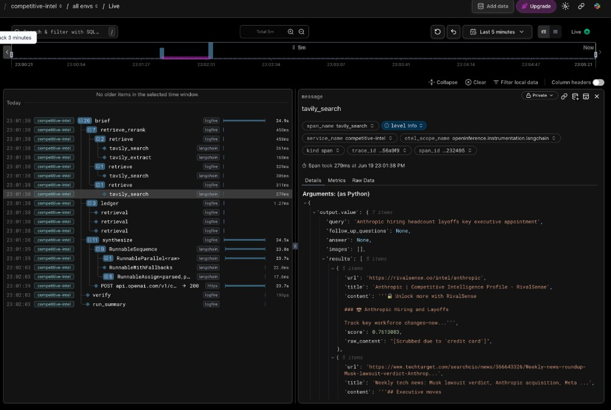
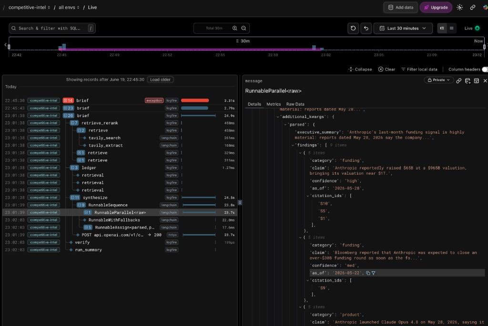
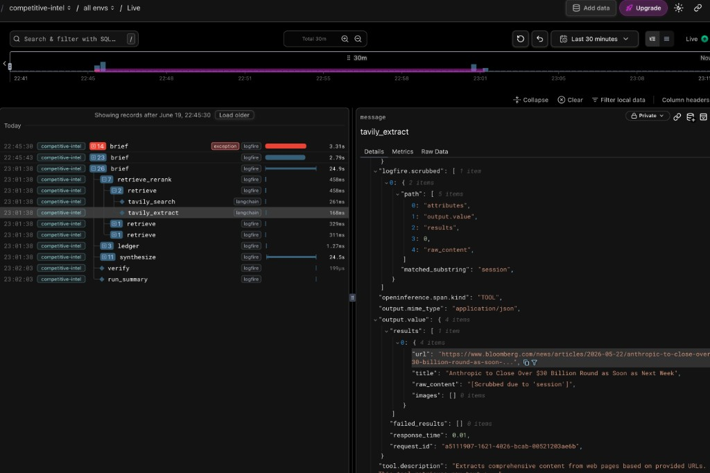

# Sample Output — Anthropic brief

Generated with:

```bash
competitive-intel brief "Anthropic" --focus funding,product,hiring --window month
```

---

## Executive summary

Anthropic's last-month funding signal is highly material: reports dated May 28, 2026 say the company raised $65B at a $965B valuation, putting it near a $1T valuation mark [S10, S5, S1]. Product cadence also appears rapid, with Anthropic launching Claude Opus 4.8 on May 28, releasing Claude Fable 5 publicly on June 9, and announcing a Claude Code Artifacts update for enterprise live dashboards and workspaces on June 18 [S8, S12, S2]. The evidence also points to developer-tooling expansion through the reported acquisition of Stainless during the week of May 18 [S7].

## Findings

### Funding
- Anthropic reportedly raised $65B at a $965B valuation, bringing its valuation near $1T. (as of 2026-05-28) [S10] [S5] [S1]
- Bloomberg reported that Anthropic was expected to close an over-$30B funding round as soon as the following week. (as of 2026-05-22) [S9]

### Product
- Anthropic launched Claude Opus 4.8 on May 28, 2026, saying it was available that day at the same price as Opus 4.7. (as of 2026-05-28) [S8]
- Anthropic said Claude Opus 4.8 included improvements across benchmarks and was designed to be a more effective collaborator than Opus 4.7. (as of 2026-05-28) [S8]
- Anthropic added user controls on claude.ai for how much effort Claude puts into a task. (as of 2026-05-28) [S8]
- Anthropic introduced a Claude Code "dynamic workflows" feature intended to let Claude Code tackle very large-scale problems. (as of 2026-05-28) [S8] [S3]
- Anthropic released the Claude Fable 5 AI model to the public on June 9, 2026. (as of 2026-06-09) [S12]
- Anthropic announced a Claude Code Artifacts update that brings live, shared dashboards and interactive workspaces to enterprise users. (as of 2026-06-18) [S2]

### Hiring
- Anthropic acquired developer-tooling startup Stainless during the week starting May 18, 2026, according to TechTarget. (as of 2026-05-22) [S7]

## Sources

- **[S1]** Anthropic Nears $1-Trillion Valuation After Massive $65B Funding — https://finance.yahoo.com/markets/stocks/articles/anthropic-nears-1-trillion-valuation-195734599.html
- **[S2]** Anthropic's Claude Code Artifacts update brings live dashboards - VentureBeat — https://venturebeat.com/data/anthropics-claude-code-artifacts-update-brings-live-shared-dashboards-and-interactive-workspaces-to-enterprises
- **[S3]** Anthropic Just Dropped the Update Everyone's Obsessed With: Dynamic Workflows — https://www.youtube.com/watch?v=c0gVowvMR-g&vl=en
- **[S5]** Anthropic Hits $965 Billion Valuation In Latest Funding Round — https://finance.yahoo.com/markets/stocks/articles/anthropic-hits-965-billion-valuation-104626610.html
- **[S7]** Weekly tech news: Musk lawsuit verdict, Anthropic acquisition, Meta — https://www.techtarget.com/searchcio/news/366643326/Weekly-news-roundup-Musk-lawsuit-verdict-Anthropic-acquisition-Meta-layoffs-Google-conference-an
- **[S8]** Introducing Claude Opus 4.8 - Anthropic — https://www.anthropic.com/news/claude-opus-4-8
- **[S9]** Anthropic to Close Over $30 Billion Round as Soon as Next Week — https://www.bloomberg.com/news/articles/2026-05-22/anthropic-to-close-over-30-billion-round-as-soon-as-next-week
- **[S10]** Anthropic Eclipses OpenAI With Valuation of $965 Billion — https://www.bloomberg.com/news/articles/2026-05-28/anthropic-raises-at-965-billion-valuation-eclipsing-openai
- **[S12]** Anthropic releases Mythos-like AI model to the public, Claude Fable 5 — https://www.cnbc.com/2026/06/09/anthropic-mythos-claude-fable-5.html

---

```
╭─────────────────────────── Run summary ───────────────────────────╮
│ Provider / model           openai / gpt-5.5                       │
│ Sources cited              9                                      │
│ Findings (kept / dropped)  9 / 0                                  │
│ Citation coverage          100%                                   │
│ Self-correction retries    0                                      │
│ Duration                   24.94s                                 │
│ Tokens (in / out)          4725 / 1704                            │
╰───────────────────────────────────────────────────────────────────╯
```

# Sample Logfire Trace

Span tree for the same run — `brief → retrieve_rerank → retrieve (×N) → tavily_search / tavily_extract → ledger → synthesize → verify → run_summary`:



The `synthesize` span showing the LangChain `RunnableParallel` internals and parsed `DraftBrief` findings:



The `tavily_extract` span showing raw full-page content fetched before reranking:


